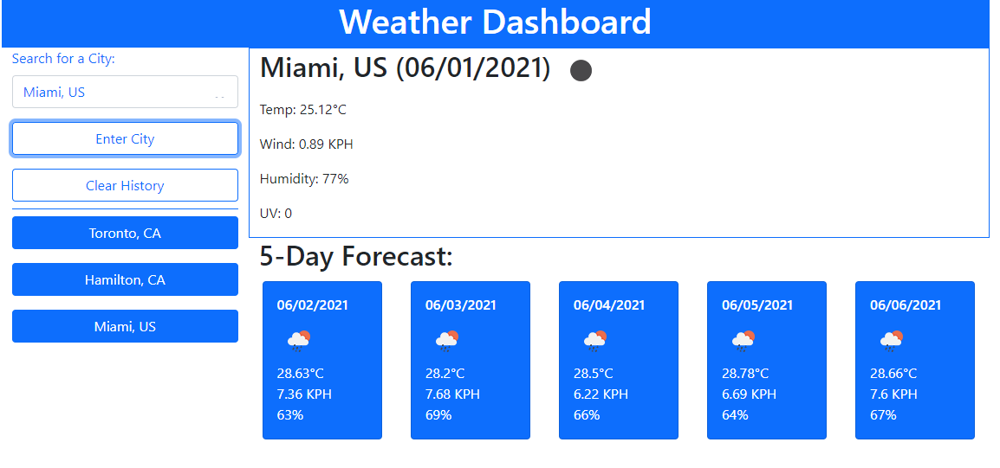

Homework Assignment - 06 Server-Side APIs: Weather Dashboard

## Description
The focus of this homework assignment for the University of Toronto SCS Coding Boot Camp was to create a weather dashboard that allows the user to get a city's current weather conditions and the five day forecast. No starter code was provided. Third-party APIs were used to access weather data by making requests with specific parameters to a URL.

## Key Features
- Two different OpenWeather APIs are used to retrieved the required weather data
- localStorage is used to save seach history and if any past search history is in local storage it is displayed when the site first loads
- User can either enter a city to search for or click on a button for a previously searched city to get the current weather and five day forecast
- jQuery event listeners are used to identify when a user wishes to search for a city (including past city) or clear search history
- New elements were created using jQuery or vanilla Javascript 
- Bootstrap was used extensively for styling and creation of new components (e.g. cards for each day of the five day forecast)
- The Bootstrap grid was used to establish containers, rows and columns
- Clean simple UI with graphical representation of weather
- Moment.js is used to convert unix timestamp to MM/DD/YYYY format
- Background color of UV index will adjust based on World Health Organization color scale

## Link
Website can be found here: https://darylnauman.github.io/weather-dashboard/

## Screenshot
The following image shows a snapshot of a portion of the webpage:

